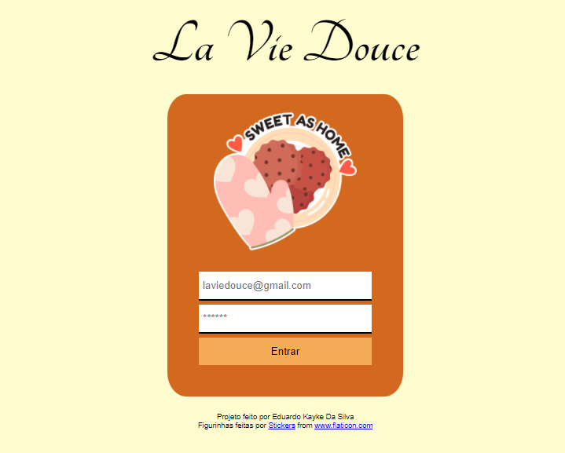

# Tela de Login La Vie Douce

## Sobre o projeto.
Tela de login de uma confeitaria fictícia, La Vie Douce. Inputs com hover deixam rosada a área ao passar o mouse e clicar no botão enviar. Tornei o input obrigatório para envio e com dicas para o usuário.

Data de conclusão: 27/10/2021

## Ferramentas e tecnologias usadas nesse projeto.
```js    
function LaVieDouce(Project) {
    const FrontEnd = `${HTML}, ${CSS}, ${JavaScript}`;
};

``` 
<br>

<div align="center">



</div>

---

> - Autores: 
>   - [Eduardo Kayke](https://github.com/EduardoKayke "Perfil do Eduardo")

- [Voltar ao perfil do Github.](https://github.com/EduardoKayke "Perfil do Eduardo") 

_Um dia seremos a tecnologia. Biohacking a própria evolução de nós mesmos._
